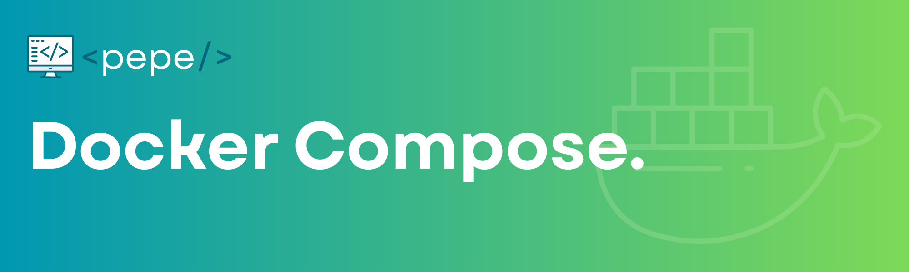

# Docker Compose



Docker Compose permite definir y ejecutar **aplicaciones multi-contenedor** con un único archivo YAML y el comando `docker compose`.

---

## ¿Qué hay de nuevo en Docker Compose?

**Docker Compose V2** está escrito en Go (vs Python en v1) y trae mejoras importantes:

Mejoras:
- **Performance:** Hasta 3x más rápido
- **Integración:** Nativa con Docker Desktop
- **Comando:** Nuevo: `docker compose` (sin guión)
- **Instalación:** Sin instalación separada; ya viene con Docker Desktop
- **Orquestación:** Mejor manejo de dependencias y redes

:::tip Comando actualizado
El comando cambió de `docker-compose` a **`docker compose`** (sin guión).
:::

---

## Verificando tu instalación

```bash
# Verificar Docker Desktop y Compose V2
docker --version
docker compose version
```

Deberías ver algo como: **Docker Compose version v2.24.x**

---

## Anatomía moderna del docker-compose.yml

En Docker Compose V2 **no hace falta** la clave `version:`; Compose detecta automáticamente la mejor versión del formato.

```yaml
# ✅ SIN version: - Docker Compose V2 detecta automáticamente la mejor versión
services:
  frontend:
    build:
      context: ./frontend
      dockerfile: Dockerfile
    ports:
      - "3000:3000"
    environment:
      - REACT_APP_API_URL=http://localhost:8000
    depends_on:
      - backend
    networks:
      - app-network
    restart: unless-stopped

  db:
    image: mongo:7-jammy
    ports:
      - "27017:27017"
    environment:
      - MONGO_INITDB_ROOT_USERNAME=admin
      - MONGO_INITDB_ROOT_PASSWORD=password123
    volumes:
      - mongo_data:/data/db
    networks:
      - app-network
    healthcheck:
      test: ["CMD", "mongosh", "--eval", "db.adminCommand('ping')"]
      interval: 30s
      timeout: 10s
      retries: 3
      start_period: 40s
    restart: unless-stopped

networks:
  app-network:
    driver: bridge
    name: mi-app-network

volumes:
  mongo_data:
    driver: local
    name: mi-app-mongo-data
```

Este archivo define y configura los servicios (contenedores), redes y volúmenes de tu aplicación, simplificando el desarrollo y la administración de entornos multicontenedor.

---

## Propiedades principales del docker-compose.yml

`services`: Define los servicios (contenedores) que forman tu aplicación. Cada clave bajo `services` es un servicio independiente.

- `frontend`
  - `build`
    - `context`: carpeta del código
    - `dockerfile`: Dockerfile a usar
  - `ports`
    - `"3000:3000"`: expone el puerto del contenedor al de tu máquina
  - `environment`: Variables de entorno para el contenedor (ej.: URL de la API)
  - `depends_on`: Este servicio espera a que otro (ej.: backend) esté listo antes de iniciar
  - `networks`: Redes a las que se conecta el servicio
  - `restart`: Política de reinicio automático si el contenedor se detiene

- `db`
  - `image`: Imagen de Docker a usar (ej.: `mongo:7-jammy`)
  - `ports`: `"27017:27017"`: puerto estándar de MongoDB
  - `environment`: Usuario y contraseña de inicialización
  - `volumes`: Volumen persistente para los datos de la base
  - `healthcheck`: Prueba periódica para verificar que el servicio responde
  - `restart`: Política de reinicio automático

### `networks`

Define redes personalizadas para aislar y conectar servicios entre sí.

### `volumes`

Define volúmenes persistentes para que los datos no se pierdan si el contenedor se elimina.

:::tip
Estas propiedades permiten definir, conectar y administrar fácilmente múltiples servicios y recursos en un solo archivo. Para todas las opciones disponibles, revisa la [Guía de Docker Compose](https://docs.docker.com/compose/), la [Referencia de docker-compose.yml](https://docs.docker.com/compose/compose-file/) y los [Comandos de Docker Compose](https://docs.docker.com/compose/reference/).
:::

---

## Comandos esenciales de Docker Compose V2

### Comandos básicos

```bash
# Levantar todos los servicios
docker compose up

# Modo detached (en segundo plano)
docker compose up -d

# Reconstruir imágenes antes de levantar
docker compose up --build

# Levantar servicios específicos
docker compose up frontend backend

# Ver estado de servicios
docker compose ps

# Ver logs en tiempo real
docker compose logs -f

# Ver logs de un servicio específico
docker compose logs -f backend

# Parar servicios sin eliminar contenedores
docker compose stop

# Parar y eliminar contenedores, redes y volúmenes anónimos
docker compose down

# Eliminar también volúmenes nombrados
docker compose down --volumes

# Eliminar todo incluyendo imágenes
docker compose down --rmi all --volumes
```

### Comandos avanzados

```bash
# Ejecutar comandos en servicios corriendo
docker compose exec backend npm run test
docker compose exec db mongosh

# Ejecutar comandos sin servicio corriendo
docker compose run --rm backend npm install

# Escalar servicios (crear múltiples instancias)
docker compose up --scale backend=3

# Ver configuración parseada
docker compose config

# Validar archivo compose
docker compose config --quiet

# Reiniciar servicios específicos
docker compose restart nginx

# Ver uso de recursos
docker compose top
```

---

## Ejemplo: WordPress con Docker Compose

Stack completo con WordPress, MariaDB y phpMyAdmin usando buenas prácticas.

**`docker-compose.yml`:**

```yaml
services:
  wordpress:
    image: wordpress:php8.2-apache
    container_name: wp-web
    restart: unless-stopped
    ports:
      - "8080:80"
    environment:
      WORDPRESS_DB_HOST: db
      WORDPRESS_DB_USER: wpuser
      WORDPRESS_DB_PASSWORD: wppass123
      WORDPRESS_DB_NAME: wpdb
    volumes:
      - wp_data:/var/www/html
      - ./wp-content:/var/www/html/wp-content  # Para desarrollo personalizado
    depends_on:
      db:
        condition: service_healthy
    networks:
      - wp_network

  db:
    image: mariadb:11.3
    container_name: wp-db
    restart: unless-stopped
    environment:
      MYSQL_ROOT_PASSWORD: rootpass123
      MYSQL_DATABASE: wpdb
      MYSQL_USER: wpuser
      MYSQL_PASSWORD: wppass123
    volumes:
      - db_data:/var/lib/mysql
    healthcheck:
      test: ["CMD", "mysqladmin", "ping", "-h", "localhost"]
      interval: 5s
      timeout: 5s
      retries: 5
    networks:
      - wp_network

  phpmyadmin:
    image: phpmyadmin:latest
    container_name: wp-admin
    restart: unless-stopped
    ports:
      - "8081:80"
    environment:
      PMA_HOST: db
      PMA_USER: wpuser
      PMA_PASSWORD: wppass123
    depends_on:
      - db
    networks:
      - wp_network

volumes:
  wp_data:
  db_data:

networks:
  wp_network:
    driver: bridge
```

**Características clave:**

- **Stack:** WordPress (PHP 8.2), MariaDB 11.3, phpMyAdmin.
- **Buenas prácticas:** volúmenes persistentes, healthcheck en MariaDB, variables de entorno, red aislada.
- **Desarrollo:** mapeo de `wp-content` para temas/plugins.

**Puertos:**

- WordPress: http://localhost:8080  
- phpMyAdmin: http://localhost:8081  

**Uso:**

1. Crea un directorio y guarda el archivo como `docker-compose.yml`.
2. Ejecuta: `docker compose up -d`
3. Accede a WordPress en el navegador y completa la instalación.

:::caution Seguridad en producción
Cambia todas las contraseñas y considera usar [secrets](https://docs.docker.com/compose/use-secrets/) para credenciales. Para alta demanda, limita recursos con `deploy.resources.limits` (CPUs y memoria).
:::

**Comandos útiles para este stack:**

| Comando | Descripción |
|---------|-------------|
| `docker compose logs -f wordpress` | Logs en tiempo real |
| `docker compose exec db mysql -u wpuser -p` | Acceder a MySQL CLI |
| `docker compose down --volumes` | Borrar todo (incluyendo datos) |

---

## Trucos y mejores prácticas

### 1. Healthchecks inteligentes

```yaml
services:
  api:
    healthcheck:
      test: ["CMD", "curl", "-f", "http://localhost:3000/health"]
      interval: 30s
      timeout: 10s
      retries: 3
      start_period: 60s
```

### 2. depends_on con condiciones

```yaml
services:
  app:
    depends_on:
      db:
        condition: service_healthy
      redis:
        condition: service_started
```

### 3. Variables de entorno avanzadas

```yaml
services:
  app:
    environment:
      - NODE_ENV=${NODE_ENV:-development}
      - PORT=${APP_PORT:-3000}
      - DATABASE_URL=${DATABASE_URL:?error}  # Obligatoria
```

### 4. Extensión de configuraciones

```yaml
# docker-compose.yml
services:
  app: &app
    build: .
    environment:
      - NODE_ENV=production

# docker-compose.override.yml (para desarrollo)
# services:
#   app:
#     <<: *app
#     environment:
#       - NODE_ENV=development
#     volumes:
#       - .:/app
```

---

## Debugging y troubleshooting

### Comandos útiles para debugging

```bash
# Ver configuración final parseada
docker compose config

# Inspeccionar redes
docker network ls
docker network inspect mern-app-network

# Ver volúmenes
docker volume ls
docker volume inspect mern-mongo-data

# Logs detallados con timestamps
docker compose logs -f --timestamps

# Ver procesos dentro de contenedores
docker compose top

# Estadísticas de uso
docker stats $(docker compose ps -q)

# Acceder a shell de contenedor
docker compose exec backend bash
docker compose exec db mongosh
```

### Problemas comunes y soluciones

| Problema | Solución |
|----------|----------|
| **Puerto ya en uso** | `lsof -i :3000` para ver el proceso; cambia el puerto en `.env` o `docker-compose.yml`. |
| **Problemas de red** | `docker compose down` → `docker network prune` → `docker compose up`. |
| **Volúmenes corruptos** | `docker compose down --volumes` → `docker volume prune`. |

---

## Tarea práctica: Node.js + MongoDB con Docker Compose

Implementar una aplicación Node.js con MongoDB usando Docker Compose, con persistencia de datos y conexión entre servicios.

### Parte 1: Configuración básica

Estructura del proyecto:

```bash
mkdir node-mongo-app && cd node-mongo-app
mkdir backend
touch backend/server.js backend/package.json backend/Dockerfile docker-compose.yml
```

**`backend/server.js`** (API simple):

```javascript
const express = require('express');
const mongoose = require('mongoose');
const app = express();

mongoose.connect('mongodb://db:27017/mydb');

app.get('/', (req, res) => {
  res.send('¡API conectada a MongoDB con Docker!');
});

app.listen(3000, () => console.log('Server running on port 3000'));
```

**`backend/Dockerfile`:**

```dockerfile
FROM node:18-alpine
WORKDIR /app
COPY package.json .
RUN npm install
COPY . .
CMD ["node", "server.js"]
```

**`docker-compose.yml`:**

```yaml
services:
  backend:
    build: ./backend
    ports:
      - "3000:3000"
    depends_on:
      db:
        condition: service_healthy

  db:
    image: mongo:6
    volumes:
      - db_data:/data/db
    healthcheck:
      test: ["CMD", "mongosh", "--eval", "db.adminCommand('ping')"]
      interval: 5s
      timeout: 3s
      retries: 5

volumes:
  db_data:
```

### Parte 2: Ejecución y verificación

```bash
# Iniciar servicios
docker compose up -d

# Probar la API
curl http://localhost:3000
# Deberías ver: "¡API conectada a MongoDB con Docker!"

# Verificar la base de datos
docker compose exec db mongosh --eval "show dbs"
```

### Parte 3: Persistencia y debugging

1. Detén y reinicia: `docker compose down && docker compose up -d`
2. Crea una colección: `docker compose exec db mongosh --eval "db.test.insertOne({name: 'Ejemplo'})"`
3. Reinicia de nuevo y comprueba que la colección sigue existiendo.

### Bonus (avanzado): Añadir frontend con React

Añade este servicio al `docker-compose.yml`:

```yaml
frontend:
  image: node:18-alpine
  working_dir: /app
  volumes:
    - ./frontend:/app
  ports:
    - "5173:5173"
  command: ["npm", "run", "dev"]
  depends_on:
    - backend
```

---

## Resumen y tips

> "Docker Compose es como tener un director de orquesta para tus contenedores. Un solo comando y toda tu aplicación cobra vida." — *Roxs*

**Pro tips:**

- Usa `.env` para todo lo configurable.
- Healthchecks en servicios críticos.
- Perfiles para separar entornos.
- Nombres explícitos para redes y volúmenes.
- Usa el nuevo comando **`docker compose`** (sin guión).
