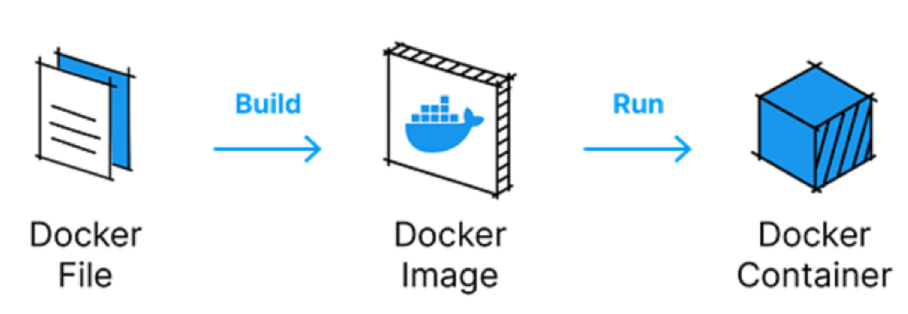
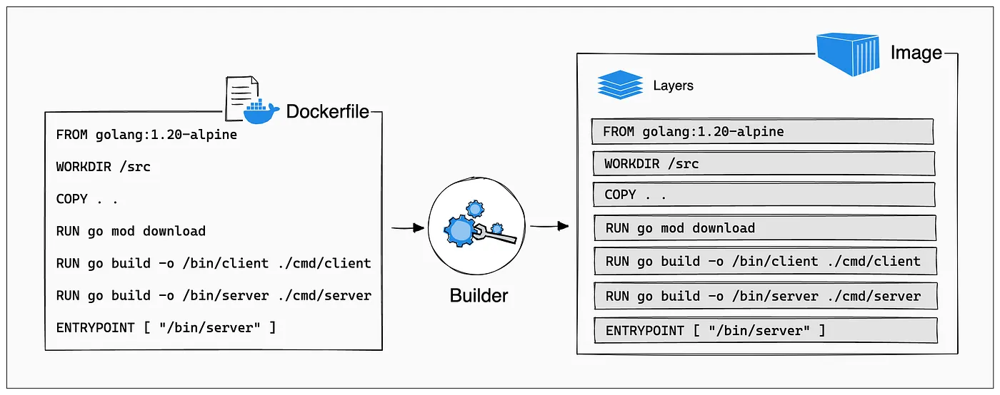
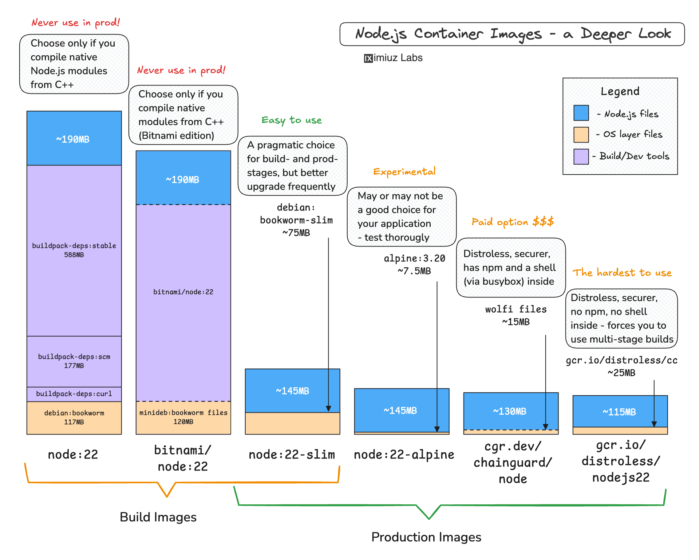

# Dockerfile

El **Dockerfile** es el archivo con el que defines cómo se construye una imagen. Aquí verás qué es, su analogía, las instrucciones principales, **las capas**, ejemplos para React, Angular y Express, imágenes ligeras, multi-stage y caché.

---

## ¿Qué es un Dockerfile?

Un **Dockerfile** es un archivo de texto con instrucciones que Docker usa para construir una **imagen** paso a paso. No es código que se ejecute dentro del contenedor; es la “receta” de construcción.



### Analogía: cocina

| Concepto    | En Docker   | En la analogía           |
| -----------| ----------- | ------------------------ |
| **Dockerfile** | Archivo con instrucciones | La **receta** (ingredientes y pasos) |
| **Imagen**     | Plantilla inmutable por capas | El **plato preparado** (listo para servir) |
| **Contenedor** | Instancia en ejecución | La **comida servida** en la mesa (cada vez que “sirves” es un contenedor) |

- Escribes la **receta** (Dockerfile).
- Con ella **preparas el plato** (`docker build` → imagen).
- Cada vez que **sirves** ese plato, obtienes una **ración** (`docker run` → contenedor).

---

## Partes e instrucciones de un Dockerfile

Cada línea es una **instrucción** que crea o modifica una **capa** de la imagen. Orden y sintaxis importan.

### Instrucciones principales

| Instrucción   | Uso |
| --------------| ----- |
| **FROM**      | Imagen base (obligatoria; suele ser la primera línea). Ej: `FROM node:20-alpine`. |
| **WORKDIR**   | Directorio de trabajo dentro del contenedor. Ej: `WORKDIR /app`. |
| **COPY**      | Copia archivos del host al contenedor. Ej: `COPY package.json .`. |
| **ADD**       | Como COPY pero puede descomprimir tar/URLs. Preferir **COPY** para archivos locales. |
| **RUN**       | Ejecuta comandos durante el **build** (instalar paquetes, etc.). Ej: `RUN npm ci`. |
| **ENV**       | Define variables de entorno. Ej: `ENV NODE_ENV=production`. |
| **ARG**       | Variable solo durante el build. Ej: `ARG NODE_ENV`. |
| **EXPOSE**    | Documenta qué puerto escucha la app (no abre el puerto; lo hace `-p` en `docker run`). Ej: `EXPOSE 3000`. |
| **CMD**       | Comando por defecto al **ejecutar** el contenedor. Solo un CMD efectivo. Ej: `CMD ["node", "server.js"]`. |
| **ENTRYPOINT**| Comando fijo al iniciar; CMD suele ser argumentos. Se usa para “ejecutable” del contenedor. |

### Formato recomendado para CMD y ENTRYPOINT

Usar **forma ejecutable** (array) para evitar que el shell interprete la línea:

```dockerfile
# Preferible
CMD ["npm", "start"]

# Evitar (usa shell y puede dar problemas con señales)
CMD npm start
```

### Ejemplo mínimo

```dockerfile
FROM node:20-alpine
WORKDIR /app
COPY package.json package-lock.json ./
RUN npm ci --omit=dev
COPY . .
EXPOSE 3000
CMD ["node", "index.js"]
```

---

## Las capas en Docker

Una **capa** es una modificación del sistema de archivos (o metadatos) que Docker guarda de forma **inmutable**. La imagen final es la **superposición** de todas las capas en orden.


### Qué es una capa

- Cada instrucción del Dockerfile que **cambia el sistema de archivos** genera una capa: `FROM`, `COPY`, `ADD`, `RUN` (lo que instala o crea).
- Instrucciones como `ENV`, `EXPOSE`, `WORKDIR` o `CMD` añaden **metadatos** a la imagen; a veces se combinan con la capa anterior o forman capas de solo metadatos.
- Las capas son **de solo lectura**. Cuando ejecutas un contenedor, Docker añade una **capa fina de escritura** encima (para cambios en runtime); esa capa se descarta al eliminar el contenedor.

### Cómo se apilan

```
    [ Capa 5: CMD ]        ← metadato
    [ Capa 4: COPY . . ]   ← archivos de tu app
    [ Capa 3: RUN npm ci ] ← node_modules
    [ Capa 2: COPY package*.json ]
    [ Capa 1: FROM node:20-alpine ]  ← imagen base (ella misma tiene muchas capas)
```

El sistema de archivos que “ve” el contenedor es la unión de todas las capas. Si un archivo se define en una capa y se modifica en otra posterior, prevalece la versión de la capa más reciente.

### Por qué importan las capas

1. **Caché**  
   Si una instrucción y su contexto no cambian, Docker reutiliza la capa ya construida. Por eso el orden del Dockerfile afecta tanto a la velocidad del build (ver sección de caché).

2. **Compartir entre imágenes**  
   Varias imágenes pueden reutilizar las mismas capas (p. ej. la de la imagen base `node:20-alpine`). Solo se guarda una vez en disco.

3. **Tamaño de la imagen**  
   Cada capa suma tamaño. Un `RUN` que instala paquetes y luego otro `RUN` que los borra no reduce el tamaño: ambas capas siguen en la imagen. Por eso se recomienda limpiar en el mismo `RUN` (p. ej. `apt-get install ... && apt-get clean && rm -rf /var/lib/apt/lists/*`).

### Ver las capas de una imagen

```bash
docker history mi-app:1.0
```

Muestra cada capa con su tamaño aproximado y la instrucción que la creó. Las capas de la imagen base aparecen como “inherited” en imágenes construidas sobre ella.

```bash
docker image inspect mi-app:1.0
```

En el JSON verás el array `RootFS.Layers` con los IDs de cada capa.

---

## Ejemplo: Dockerfile para React

React se suele construir en Node y servirse como estáticos (p. ej. con Nginx).

```dockerfile
# Fase 1: build
FROM node:20-alpine AS builder
WORKDIR /app
COPY package.json package-lock.json ./
RUN npm ci
COPY . .
RUN npm run build

# Fase 2: servir con Nginx
FROM nginx:alpine
COPY --from=builder /app/build /usr/share/nginx/html
EXPOSE 80
CMD ["nginx", "-g", "daemon off;"]
```

Uso:

```bash
docker build -t mi-react-app .
docker run -d -p 8080:80 mi-react-app
```

---

## Ejemplo: Dockerfile para Angular

Misma idea: construir con Node y servir los estáticos con Nginx. Aquí se ve bien el uso de **caché** (más abajo): primero se copian solo `package*.json` y se instalan dependencias; luego el resto del código.

```dockerfile
# Fase 1: build
FROM node:20-alpine AS builder
WORKDIR /app
COPY package.json package-lock.json ./
RUN npm ci
COPY . .
RUN npm run build

# Fase 2: servir
FROM nginx:alpine
COPY --from=builder /app/dist/mi-proyecto/browser /usr/share/nginx/html
EXPOSE 80
CMD ["nginx", "-g", "daemon off;"]
```

Ajusta `dist/mi-proyecto/browser` al path que genere tu `ng build` (por ejemplo `dist/angular-app/browser`).

---

## Ejemplo: Dockerfile para Express (Node.js API)

Una API Node corre con el runtime de Node; no hace falta Nginx para servir el binario.

```dockerfile
FROM node:20-alpine
WORKDIR /app
COPY package.json package-lock.json ./
RUN npm ci --omit=dev
COPY . .
EXPOSE 3000
CMD ["node", "server.js"]
```

Si el punto de entrada es otro (p. ej. `index.js` o `src/index.js`), cambia el último argumento de `CMD`.

```bash
docker build -t mi-api .
docker run -d -p 3000:3000 mi-api
```

---

## Imágenes “fat” vs Alpine: reducir el peso


### Imágenes “fat” (grandes)

- Basadas en distros completas: `ubuntu`, `debian`, `node` (sin sufijo).
- Incluyen muchas herramientas y librerías.
- Tamaño típico: cientos de MB o más de 1 GB.
- Útiles para depuración o cuando necesitas muchas dependencias del sistema.

### Imágenes Alpine (ligeras)

- Basadas en [Alpine Linux](https://alpinelinux.org/): muy pequeñas.
- Se nombran con el sufijo `-alpine`, p. ej. `node:20-alpine`, `nginx:alpine`.
- Tamaño: decenas de MB (p. ej. `node:20-alpine` ~180 MB vs `node:20` ~1 GB).
- Menos herramientas por defecto; a veces hace falta instalar paquetes con `apk add`.

### Cómo reducir el tamaño de las imágenes

1. **Usar imagen base Alpine (o slim)**  
   `node:20-alpine`, `python:3.11-slim`, `nginx:alpine`.

2. **No instalar cosas innecesarias**  
   En producción no suelen hacer falta compiladores, dev-dependencies ni herramientas de desarrollo. Usa `npm ci --omit=dev` (o `--production`).

3. **Multi-stage build**  
   Construyes en una imagen “grande” (con compilador, Node, etc.) y copias solo el resultado (estáticos o binario) a una imagen final pequeña (Alpine, distroless).

4. **Limpiar caché en la misma capa**  
   En imágenes basadas en Debian/Ubuntu, combinar en un solo `RUN`: instalar y luego `apt-get clean && rm -rf /var/lib/apt/lists/*`.

5. **Usar `.dockerignore`**  
   Para no copiar `node_modules`, `.git`, `README.md`, etc., al contexto de build y así acelerar y mantener capas más limpias.

---

## Multi-stage: un Dockerfile, varias etapas

Un **multi-stage Dockerfile** usa varios `FROM`. Solo el último `FROM` (y lo que se construye a partir de él) forma la imagen final; las etapas anteriores solo sirven para generar archivos (build de front, compilación, etc.).

Ventajas:
- La imagen final no incluye Node, compiladores ni código fuente; solo el resultado (estáticos, binario).
- Imagen más pequeña y con menos superficie de ataque.


Ejemplo: construir una app Node y dejar solo el runtime y el código necesario.

```dockerfile
# Etapa 1: build y tests
FROM node:20-alpine AS builder
WORKDIR /app
COPY package.json package-lock.json ./
RUN npm ci
COPY . .
RUN npm run build

# Etapa 2: solo producción
FROM node:20-alpine
WORKDIR /app
COPY package.json package-lock.json ./
RUN npm ci --omit=dev
COPY --from=builder /app/dist ./dist
EXPOSE 3000
CMD ["node", "dist/index.js"]
```

`COPY --from=builder` copia desde la etapa llamada `builder`, no desde el host.

---

## Caché de capas: por qué copiar primero `package*.json`

Cada instrucción del Dockerfile crea una **capa** (o modifica metadatos). Docker reutiliza capas ya construidas si la instrucción y su contexto no han cambiado. Si una capa cambia, todas las que vienen después se vuelven a ejecutar.

### Orden que aprovecha la caché

En el Dockerfile de Angular (y en los de React/Express) se hace:

1. **Copiar solo `package.json` y `package-lock.json`**
2. **Ejecutar `npm ci`** (o `npm install`)
3. **Copiar el resto del código** (`COPY . .`)
4. **Ejecutar el build** (`npm run build`)

Así:
- Si **no cambian** las dependencias, la capa de `npm ci` se reutiliza (caché).
- Si **solo cambia** tu código (`.ts`, `.html`, etc.), Docker reconstruye desde `COPY . .` y el build, pero **no** vuelve a instalar dependencias.

Si hicieras `COPY . .` antes de `RUN npm ci`, cualquier cambio en cualquier archivo invalidaría la caché y repetirías `npm ci` en cada build, que es lo más lento.

### Resumen

| Orden | Comportamiento |
| ----- | ----------------- |
| Primero `COPY package*.json` y `RUN npm ci`, luego `COPY . .` | Caché de dependencias; builds rápidos cuando solo cambia código. |
| Primero `COPY . .`, luego `RUN npm ci` | Cualquier cambio invalida la capa y reinstala todo. |

---

## .dockerignore

El **contexto de build** es la carpeta que pasas a `docker build` (por ejemplo `.`). Por defecto se envían todos los archivos. Un archivo **`.dockerignore`** en la raíz del proyecto excluye archivos y carpetas (igual que `.gitignore`).

Ejemplo:

```text
node_modules
.git
.gitignore
README.md
.env
.env.*
*.md
Dockerfile
.dockerignore
```

Así evitas copiar `node_modules` y archivos que no aportan al build, aceleras el build y mantienes la imagen más predecible.

---

## Resumen de comandos

```bash
# Construir imagen
docker build -t mi-app:1.0 .

# Construir sin usar caché (rebuild completo)
docker build --no-cache -t mi-app:1.0 .

# Ver capas de una imagen
docker history mi-app:1.0
```

---

## Reto del día

Usa el repositorio **[Node-Mario](https://github.com/JuanJoseMirandaM/Node-Mario)** (backend del juego multijugador N-Mario) y completa estos pasos:

1. **Clona el repositorio** y entra en la carpeta del proyecto.
2. **Crea un Dockerfile** para el backend: el servidor es Node.js, el punto de entrada es `server.js` y escucha en el puerto **21474** (usa `process.env.PORT || 21474`). Aprovecha el orden de capas: copia primero `package.json`, instala dependencias y luego copia el resto del código.
3. **Construye la imagen** y **levanta un contenedor** publicando el puerto 21474.
4. **Conecta el frontend al backend**: el cliente del juego está en la [página de N-Mario en GitHub Pages](https://cherrry.github.io/N-Mario). Al cargar la página, introduce la dirección del servidor (por ejemplo `localhost:21474` si el contenedor corre en tu máquina) y juega.

### Pistas

- El backend usa **Socket.IO** y sirve la lógica del juego; el frontend en GitHub Pages solo necesita la URL y puerto de tu servidor para conectarse por WebSocket.
- Si el frontend no conecta, revisa que el contenedor esté en ejecución y que hayas mapeado el puerto con `-p 21474:21474` (o el puerto que uses).

### Comprobación

Has completado el reto cuando puedes abrir el cliente en el navegador, indicar la dirección de tu servidor en el contenedor y jugar N-Mario (elegir sala, empezar partida y ver a los personajes en tiempo real).
